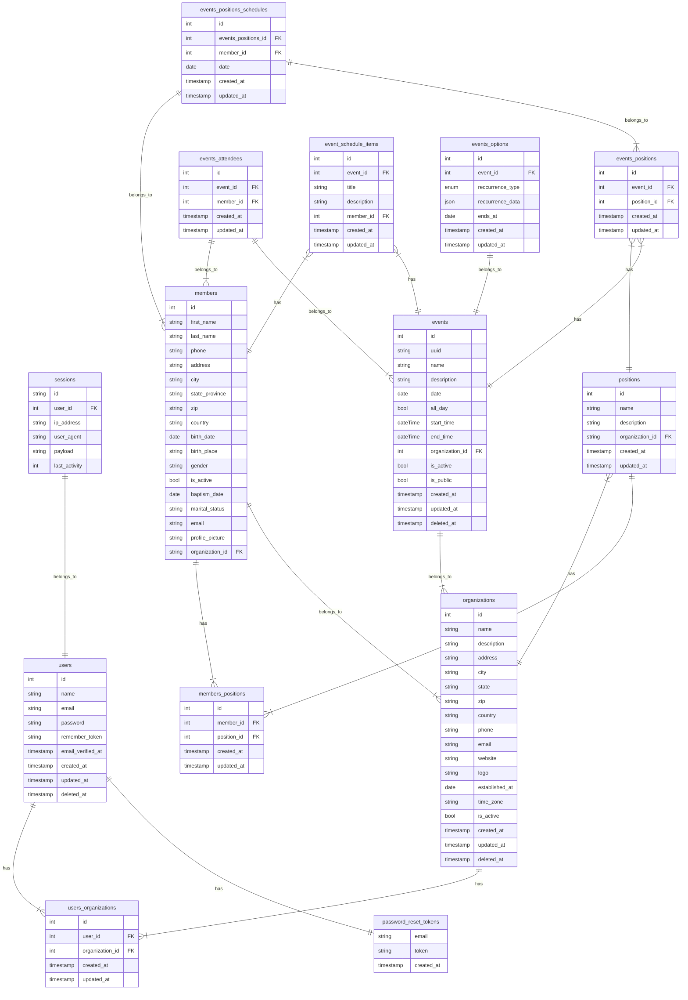

## ER Diagram

```mermaid
erDiagram
    users ||--|| password_reset_tokens : has
    users ||--|{ users_organizations: has 
    users {
        int id
        string name
        string email
        string password
        string remember_token
        timestamp email_verified_at
        timestamp created_at
        timestamp updated_at
        timestamp deleted_at
    }

    password_reset_tokens {
        string email
        string token
        timestamp created_at
    }
    
    sessions ||--|| users : belongs_to
    sessions {
        string id
        int user_id FK
        string ip_address
        string user_agent
        string payload
        int last_activity
    }
    
    organizations ||--|{ users_organizations : has
    organizations {
        int id  
        string name
        string description
        string address
        string city
        string state
        string zip
        string country
        string phone
        string email
        string website
        string logo
        date established_at
        string time_zone
        bool is_active
        timestamp created_at
        timestamp updated_at
        timestamp deleted_at
    }

    users_organizations {
        int id
        int user_id FK
        int organization_id FK
        timestamp created_at
        timestamp updated_at
    }

    members ||--|{ organizations : belongs_to
    members {
        int id
        string first_name
        string last_name
        string phone
        string address
        string city
        string state_province
        string zip
        string country
        date birth_date
        string birth_place
        string gender
        bool is_active
        date baptism_date
        string marital_status
        string email
        string profile_picture
        string organization_id FK
    }

    members ||--|{ members_positions : has
    positions ||--|{ members_positions : has
    members_positions {
        int id
        int member_id FK
        int position_id FK
        timestamp created_at
        timestamp updated_at
    }

    positions }|--||organizations : has
    positions {
        int id
        string name
        string description
        string organization_id FK
        timestamp created_at
        timestamp updated_at
    }

    events ||--|{ organizations : belongs_to
    events {
        int id
        string uuid
        string name
        string description
        date date
        bool all_day
        dateTime start_time
        dateTime end_time
        int organization_id FK
        bool is_active
        bool is_public
        timestamp created_at
        timestamp updated_at
        timestamp deleted_at
    }

    events_positions }|--|| events : has
    events_positions }|--|| positions : has
    events_positions {
        int id
        int event_id FK
        int position_id FK
        timestamp created_at
        timestamp updated_at
    }
   
    events_positions_schedules ||--|{ events_positions : belongs_to
    events_positions_schedules ||--|{ members : belongs_to
    events_positions_schedules {
        int id
        int events_positions_id FK
        int member_id FK
        date date
        timestamp created_at
        timestamp updated_at
    }
    
    events_attendees ||--|{ events : belongs_to
    events_attendees ||--|{ members : belongs_to
    events_attendees {
        int id
        int event_id FK
        int member_id FK
        timestamp created_at
        timestamp updated_at
    }

    event_schedule_items }|--||events : has
    event_schedule_items }|--||members : has
    event_schedule_items {
        int id
        int event_id FK
        string title
        string description
        int member_id FK
        timestamp created_at
        timestamp updated_at
    }

    events_options ||--|| events : belongs_to
    events_options {
        int id
        int event_id FK
        enum reccurrence_type
        json reccurrence_data
        date ends_at
        timestamp created_at
        timestamp updated_at
    }
```
